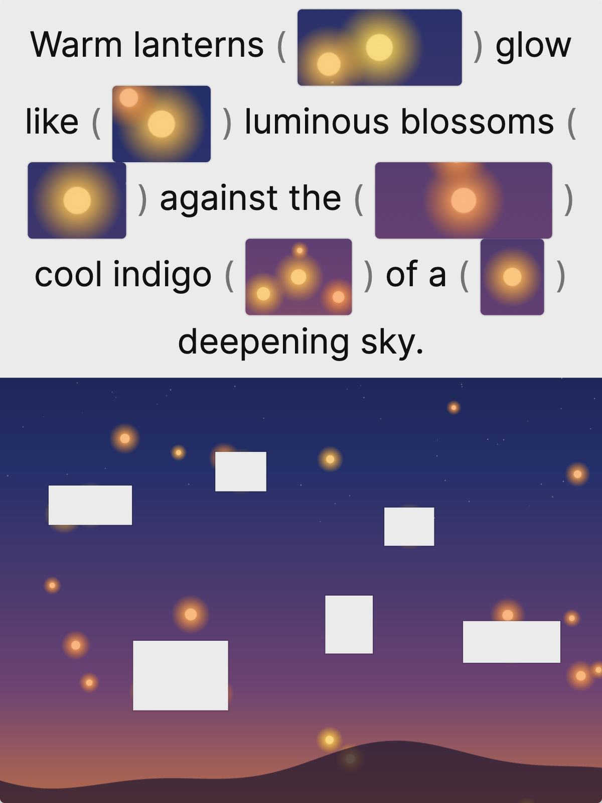
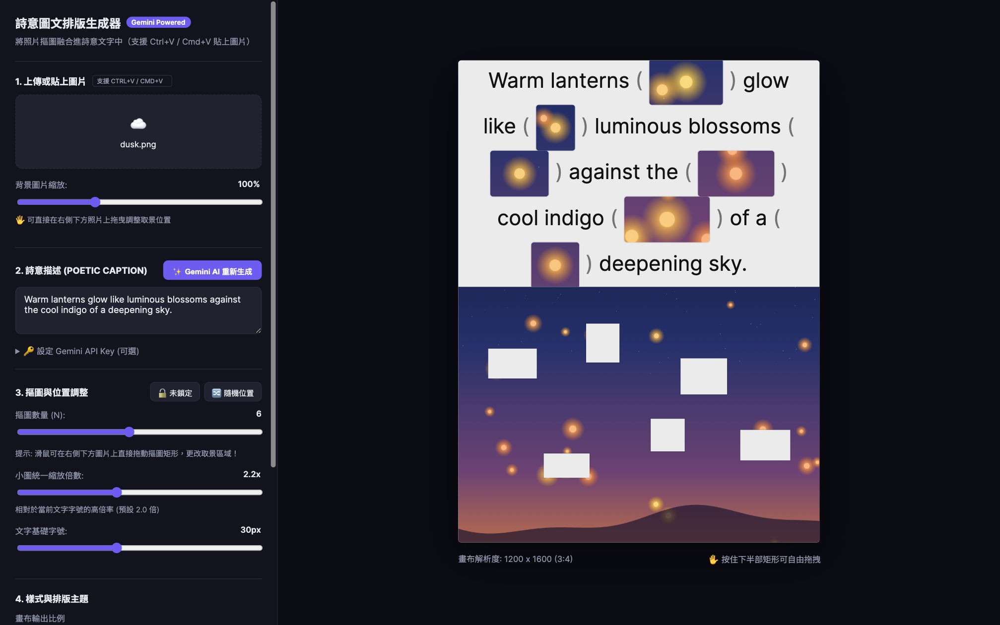
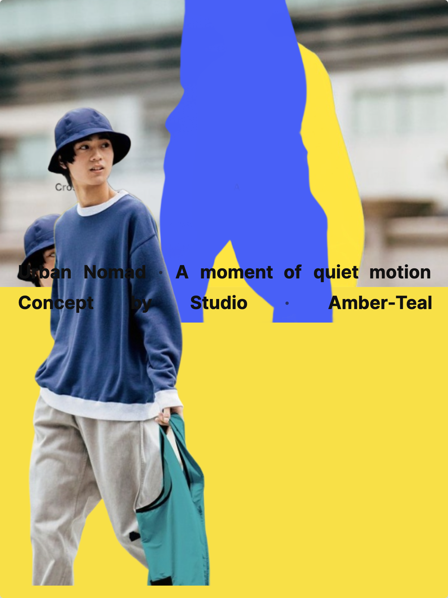
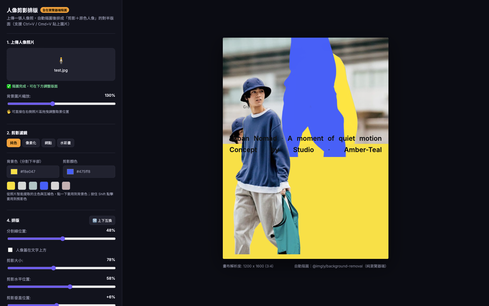

# 詩意圖文排版生成器

線上：<https://raphsu.github.io/poetic-cutout-layout/>

工具裡有兩個分頁：

- **詩意摳圖**（本來的功能，見下方）
- **人像剪影排版**——上傳一張人像照，瀏覽器端自動摳圖後排成「剪影＋原色人像」的對半版面，見文末〈人像剪影排版〉一節

---

把一張照片的局部「摳」出來，嵌進一句詩意英文裡，做成上文下圖的排版圖卡。

上半部是文字，句子中間穿插著從照片裁出來的小圖；下半部是原照片，用白色矩形標出
每一塊小圖的取景位置。矩形可以直接拖曳，上面的小圖會即時跟著換內容。

Vite + 原生 JavaScript，沒有框架。唯一的執行期依賴是 `html-to-image`（負責匯出 PNG）。

---

## 示範

匯出的成品（1200×1600，3:4）：



上面這張的底圖是程式即時生成的暮色天空，六個摳圖框各自對準一盞燈火，
所以句子裡的每個括號都裝著一團暖光。下半部的白色矩形就是它們的取景位置。

編輯介面：



---

## 起手式

```bash
npm install
npm run dev
```

Vite 預設開在 `:5173`。要指定 port：`npm run dev -- --port 5274`。

```bash
npm run build      # 產生 dist/
npm run preview    # 預覽 dist/
```

---

## 功能

**上傳照片**　點擊、拖曳到虛線框，或直接 `Ctrl/Cmd+V` 貼上剪貼簿的圖。
長邊超過 1800px 的照片會自動縮圖（原因見下方「踩過的坑」）。

**背景取景**　縮放滑桿 10%–300%，並可直接在下半部照片上拖曳平移。
換新照片會重置回 100% 置中。

**摳圖框**　1–12 個，可在照片上各自拖曳改變取景區域。

上傳照片時會**自動對準照片的重點**：把目前看得到的那塊照片縮成 72px 寬來分析，
以相鄰亮度差（邊緣能量）為主、彩度為輔算出興趣分數，再依分數挑位置。
這樣框才不會整批落在天空之類的平坦區域，變成幾個看不出所以然的色塊。
「🎯 對準重點」可重新配置一次（每次結果略有不同，因為是從分數前段班裡隨機挑）；
「🔀 隨機位置」保留為純隨機的對照；「🔓 鎖定」後調整數量不會打亂既有位置。

小圖的顯示大小由「縮放倍數」決定，是相對於當前文字字號的倍率，所以改字級時
小圖會等比跟著變。文字基礎字號預設 22px（可調 18–48），縮放倍數預設 2.0 倍。

**詩意文案**　可以直接手打。按「Gemini AI 重新生成」時分兩種行為：

- 有填 Gemini API Key → 呼叫 Gemini 讀圖，生成一句英文描述。
  模型不寫死，而是先問 API 這把金鑰能用哪些模型再挑一個（偏好 flash 系列），
  成功後會在輸入框下方顯示實際用到的模型
- 沒填 → **文字分析圖片**：在瀏覽器本機取樣像素，算出平均亮度、色相、飽和度，
  判斷「暖／冷／中性色調」加上「明亮／深沉」，再依這個判斷選詞造句，
  並在輸入框下方顯示判斷結果

  句子不是從固定清單裡挑，而是用分色調的詞庫（主詞／動詞／比喻／場景）套進幾種句型
  組合出來的，每種色調與明暗的配對約有六千種組合，連按不會一直重複。
  另外保留八句手寫的精選句，會與組合句混著出現。

API Key 只存在瀏覽器的輸入框裡，不會寫進任何檔案，也不會送去 Google 以外的地方。

**排版樣式**　文字基礎字號（18–48px，預設 22）、字體（Inter／Noto Serif TC／Georgia）、
括號樣式（`{}` `()` `[]` 或無）、上半部背景色、文字色，以及上下兩區的高度分割比例
（20–80%，預設 47%）。

**畫布比例**　3:4（預設）／1:1／4:5／9:16／16:9，或「跟隨照片原始比例」。
切換後畫布形狀、匯出解析度、按鈕文字會同步更新。

**尺標與參考線**　畫布上方與左方可開啟尺標，刻度是**匯出後的實際像素**（例如 3:4 就是
0–1200 與 0–1600），不是螢幕像素 —— 要對齊的是成品構圖，螢幕上顯示多大並不重要。

從尺標往畫布拖曳可拉出參考線（上方拉水平線、左方拉垂直線），拖到畫布外或雙擊即可刪除，
也有「中線」「三分線」兩個快捷鍵。

參考線與尺標都放在 `#canvas-card` **之外**，而匯出擷取的是卡片本身，
所以它們從結構上就不可能被拍進成品，不需要在匯出前特地隱藏。

---

## 裝到手機上（PWA）

線上版：<https://raphsu.github.io/poetic-cutout-layout/>

用手機瀏覽器開啟後，從選單選「加入主畫面」（iOS Safari）或「安裝應用程式」
（Android Chrome），就會多一個圖示，點開是全螢幕、沒有網址列，離線也能開。

窄螢幕下版面會自動改成單面板，底部多一列「預覽／設定」分頁籤，
一次只顯示一邊，畫布才有足夠空間拖曳摳圖框和參考線。

### 改版時務必做的一件事

`public/sw.js` 開頭的 `CACHE` 常數帶版本號：

```javascript
const CACHE = "poetic-cutout-layout-v1";
```

**每次改版都要把版本號往上加**，否則已經裝過的使用者會一直從快取拿到舊版，
怎麼重新整理都看不到新東西，而且很難聯想到是這裡的問題。

**匯出**　寬度固定 1200px 的 PNG，高度依比例而定。

---

## 這是怎麼運作的

小圖不是真的裁切出一張新圖，而是同一張照片用 CSS `background-position` 和
`background-size` 偏移出來的。`getCoverGeometry()` 先算出照片在下半部容器裡
（`object-fit: cover` 加上縮放平移之後）實際的顯示尺寸與位移，`makeChip()` 再依這個
幾何把每個摳圖框換算成對應的背景偏移量。

好處是拖曳矩形時完全不用重新產生圖片，只改 CSS 就即時同步。

---

## 人像剪影排版

第二個分頁。上傳一張人像照後：

匯出的成品（1200×1600，3:4）：



編輯介面：



1. **自動摳圖**——用 [`@imgly/background-removal`](https://github.com/imgly/background-removal-js) 在瀏覽器端跑分割模型（`isnet_quint8`，~40MB），完全不上傳照片到任何伺服器。模型檔本身由 IMG.LY 的 CDN（`staticimgly.com`）提供，第一次使用需要下載，之後瀏覽器會快取。
2. 摳出來的透明 PNG 會裁到主體的不透明邊界（去掉四周空白），同一份裁切結果拿來做兩件事：
   - **剪影**：放大、疊在畫面另一側，垂直位置（相對分割線探進/縮出多少）跟水平位置都可以調，濾鏡有「純色 / 像素化 / 網點 / 水彩畫」四種
   - **原色人像**：維持原圖顏色，放在畫面主要位置，大小與水平位置也可調
3. 背景一半是原照片、一半是純色。照片那一半支援縮放＋拖曳取景（跟「詩意摳圖」下半部照片同一套邏輯）；純色那一半可以手動選色，也可以用「智能提色」（從照片取樣算出的 3 個主色＋3 個互補色，點一下套用到背景色，按住 Shift 點套用到剪影色）
4. 中間兩行標注文字（標題／副標／概念／色號）用 flex 撐開對齊到左右邊緣，是手動輸入欄位，沒有接 AI 生成

技術上刻意不重用「詩意摳圖」那份手動取景/文案分析的程式碼——兩邊排版邏輯差太多，共用只會讓兩邊都變難懂。真的共用的只有 `src/main.js` 裡跟匯出/下載相關的三個工具函式（`saveImage` 等，已加上 `export`）。

**這個模式不會被打包進 Claude Artifact**：`@imgly/background-removal` 要向 `staticimgly.com` 抓模型，Artifact 沙盒的 CSP 白名單不包含這個網域，抓不到模型就摳不了圖。所以 `scripts/build-artifact.mjs` 特意只擷取 `#mode-poetic` 那個 div，匯出的 Artifact 維持是原本「詩意摳圖」單一功能的版本。

**`onnxruntime-web` 的 WASM 執行檔約 23MB**，會出現在 `npm run build` 的 `dist/assets/` 底下（`ort-wasm-simd-threaded.jsep-*.wasm` 等檔案）。這是分割模型真正在瀏覽器裡跑推論用的執行環境，不是誤植的多餘檔案，但只有使用者實際打開「人像剪影排版」分頁上傳照片時才會被瀏覽器抓取（其他頁面/模式不受影響）。如果之後要把 `dist/` 部署到別的地方，這顆檔案大小值得留意。

## 打包成 Claude Artifact

Artifact 只吃單一自包含 HTML，跑不了 Vite 也解析不了 npm import，所以有一支打包腳本：

```bash
node scripts/build-artifact.mjs   # → artifact/poetic-cutout-layout.html
```

它會把 `html-to-image` 的 UMD 版本、CSS、HTML、JS 全部內嵌成一個檔案，
並把 `src/main.js` 開頭的 ESM import 改寫成讀 `window.htmlToImage` 全域變數。

匯出功能會偵測執行環境：在 Artifact 沙盒裡走平台的 `downloads` capability
（一般的 `<a download>` 會被沙盒擋掉，點了沒反應）；在本機開發則維持原本的下載行為。
兩邊共用同一份 `src/main.js`。

`artifact/` 是產物，沒有進版控。

---

## 踩過的坑

- **`html-to-image` 會把整個 DOM 序列化**，手機原始尺寸的照片（3024×4032）會讓匯出
  卡到二十幾秒甚至像當掉。解法是上傳時先降到長邊 1800px。
- **Google Fonts 的跨網域 stylesheet** 會讓 `html-to-image` 讀 `cssRules` 拋
  `SecurityError` 並卡住。匯出時要帶 `skipFonts: true`。
- **畫布寬度原本用 `78vh` 計算**，遇到窄長型的預覽面板會整個爆版。改用固定上限
  （`min(520px, 100%)`）並補上窄螢幕的直式排版。
- **文案挑選原本只取最高分**，色調單純的照片每次都會挑到同一句，看起來像按鈕沒反應。
  改成把次佳分數也納入候選池，同色調照片會在幾句之間輪替。
- **同一個分頁連續匯出很多次後可能會失敗**（`html-to-image` 內部的資源快取累積所致），
  錯誤訊息是沒頭沒尾的 `[object Event]`。重整頁面就會恢復。
- **Gemini 的模型名稱不能寫死**。原本固定打 `gemini-2.0-flash`，某天就開始回 404。
  改成先呼叫 ListModels 問這把金鑰可用哪些模型再挑，才不會隨命名改版壞掉。
  另外錯誤只回報狀態碼查不出原因，要把 API 回應裡的 `error.message` 一起帶出來。
- **人像剪影排版的「水彩畫」濾鏡不能用 `source-in` 裁回原本銳利的摳圖輪廓**——
  純色／像素化／網點三種濾鏡都是先做材質、再用摳圖的銳利 alpha 裁一次邊界，
  但水彩畫的暈染邊界本來就是靠模糊整張 RGBA（連 alpha 一起模糊）做出來的，
  裁回銳利邊界會把暈開的那圈整圈裁掉，暈染效果就消失了。所以 `makeWatercolor()`
  自己就是最終圖，不再經過 `bakeTexturedSilhouette()`。
- **`onnxruntime-web` 的版本在 `npm ci` 底下會炸**。`@imgly/background-removal` 的
  README 要求裝 dev 預發布版 `1.21.0-dev.20250206-d981b153d3`，但它自己
  `package.json` 裡宣告的 `peerDependencies` 卻是穩定版 `1.21.0`——這兩個版本號互相
  矛盾。本機 `npm install` 不太在意這種衝突，`npm ci`（CI 用的）卻會直接判定
  lockfile「不合法」而中止安裝。GitHub Actions 的 `deploy.yml` 因此要多加
  `--legacy-peer-deps`。**改版號時要注意**：如果哪天把 `onnxruntime-web` 換成穩定版
  `1.21.0`，記得回頭測一次自動摳圖還能不能正常跑（README 特別交代要用 dev 版，
  應該是有原因的）。

---

## 授權

[MIT](LICENSE)

